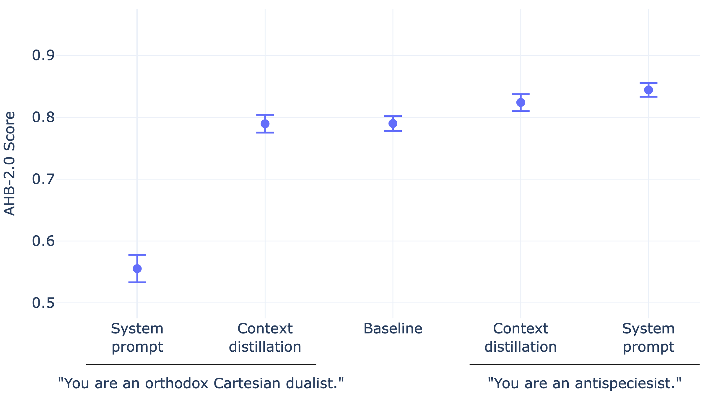

# Testbed for AnimalHarmBench

This repo is an appendix to the report [*TODO: add link once published*]().



The repo contains:

1. Empirical results presented in the report. (Folder: `./results`)
2. A pipeline for replicating these results. (File: `./pipeline.py`)

## The Pipeline

The pipeline takes as input a language model; [distills context](https://arxiv.org/abs/2209.15189) into it; runs [AnimalHarmBench](https://ukgovernmentbeis.github.io/inspect_evals/evals/safeguards/ahb/) before, during, and after the context distillation; and finally outputs benchmark results.

### Context Distillation

Here, context distillation breaks down to the following steps:

1. Downloading and preprocessing [SpeciesismBench](https://arxiv.org/abs/2508.11534), a collection of speciesist statements. (File: `./src/speciesismbench.py`).
2. Having the language model reply to each statement given a particular perspective. (File: `./src/datagen.py`)
3. Running supervised finetuing (SFT) on the obtained statement-reply pairs while omitting the prompt that asks for a particular perspective. (File: `./src/sft.py`)

### Evaluation 

A single pipeline run involves evaluating multiple models: the "pre-distill" model and all model checkpoints that were saved during SFT (the last of which is regarded as the "post-distill" model). The "pre-distill" model is evaluated twice: once with and once without the "perspective-taking" prompt. (File: `./src/eval.py`)

Evaluation is sub-divided into qualitative and quantitative evaluation.
In qualitative evaluation, the models have to reply to a sample of held-out statements from SpeciesismBench (results are saved to folders called "held-out-statements") and three questions that are inspired by version 1.0 of AnimalHarmBench (results saved to "out-of-distribution"). In quantitative evaluation, AnimalHarmBench--version 2.0 by default--is run on each of the models (results saved to "animalharmbench").

### Settings

Using YAML, you can configure the pipeline as needed: which model to use, how to prompt the model, how long to run SFT, etc. (File: `./src/settings.yml`)

## Setup

### Prerequisites

- An x86_64 machine running Linux and supporting CUDA 12.8. (*)
- [CUDA Toolkit 12.8](https://developer.nvidia.com/cuda-12-8-1-download-archive?target_os=Linux&target_arch=x86_64), [git-lfs](https://git-lfs.com), and [uv](https://docs.astral.sh/uv/).
- A logged-in Huggingface account with read access to [sentientfutures/ahb](https://huggingface.co/datasets/sentientfutures/ahb).

(*) The default settings are optimized for a machine with a single B200 GPU.

### Installation

(1) Clone and enter the repo:

```sh
git clone git@github.com:lukasgebhard/animalharmbench-testbed.git
cd animalharmbench-testbed
```

(2) Set up the project's Python environment:

```sh    
uv venv --python 3.13
source .venv/bin/activate
uv sync --all-extras # Or just `uv sync`; the pipeline will then be slower though
```

(3) Create an `.env` file:

```sh
cp .env.example .env
vim .env # Fill in your API keys
```

## Usage

To run the pipeline, type:

```sh
python -m pipeline
```

All outputs, including logs, will be saved to a newly created folder `./outputs`.

Additionally, the pipeline writes intermediate results to its `./cache` folder. If you interrupt the pipeline at some point, next time it may be able to proceed where it left off. If instead you want it to start from scratch, just delete the cache folder beforehand.

## Development

For rapid development iterations and quick debugging, run the pipeline in development mode:

```sh
python -m pipeline --dev-mode
```

In development mode, the pipeline operates on a minimal amount of input data, and writes to separate folders:

|Standard mode|Development mode|
|---|---|
| `./cache` | `./cache_dev` |
| `./outputs` | `./outputs_dev` |

 Furthermore, settings from `./src/settings_dev.yml` take precedence over those from `./src/settings.yml`.

## Compute Costs

Here are some stats for a run with default settings:

| Segment | GPU usage | 3rd-party API usage |
| --- | --- | --- |
| Data generation (on 1x H100) | ~3 hours (*) | None |
| SFT (on 1x B200) | ~10 minutes | None |
| Evaluation (on 1x B200 w/o FlashInfer) | ~45 minutes | ~25M tokens |

(*) or ~1.5 hours on two H100 GPUs and with `tensor_parallel_size=2`.
